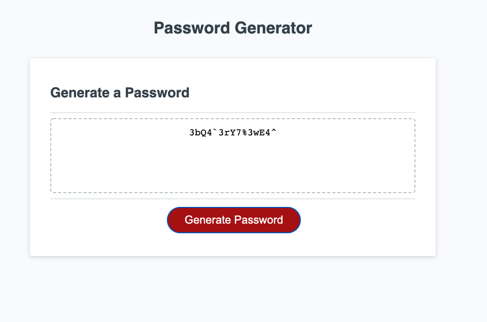

# Password Generator Starter Code

# Description
This application is used to generate a random password base on the following selected criteria from the end user.

```bash
Password Length 8-128
Lower Case Letters
Upper Case Letters
Numbers
Special Characters
```
# Screenshots


# Live Website
https://vuelee0.github.io/password-generator/